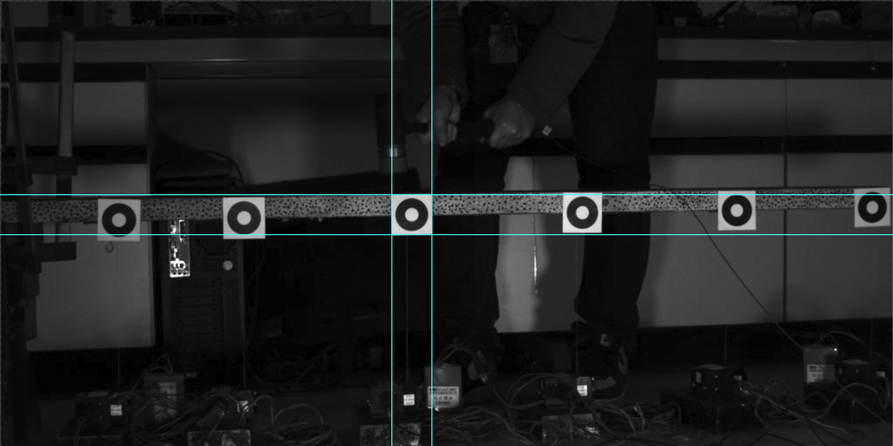
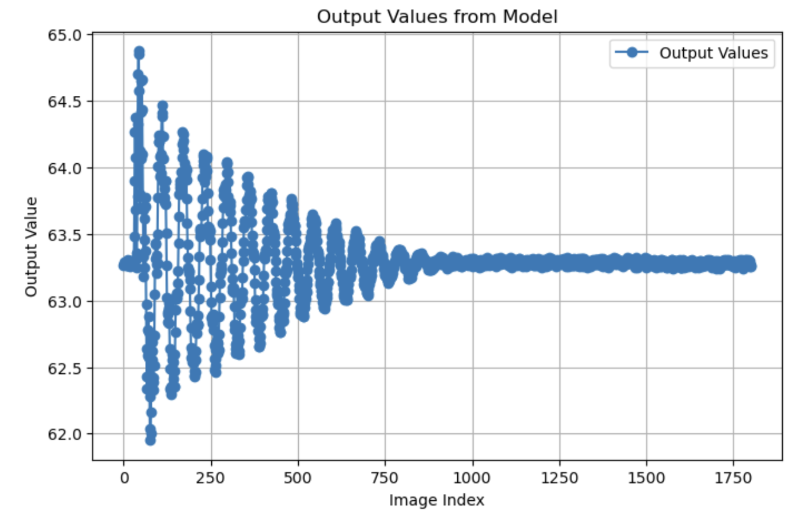

# 视频帧中小圆环的微小位移检测

使用 PyTorch 定位视频帧中的圆环。

Jupyter Notebook & 脚本

## 简介

本资源库包含用于视频帧提取、图像处理、数据集生成和模型训练的脚本和笔记本，重点关注图像分析任务。这些组件旨在支持信号处理、计算机视觉和机器学习等领域的研究与开发。

<div align=center>
  
</div>


## 项目结构

以下是项目目录的概览：

```bash
D:.
│  数据处理和生成.ipynb
│  模型和训练.ipynb
│  main.py
├─archive
├─data
│  │  振动视频1.avi 
│  ├─cropped
│  ├─original
│  ├─processed
│  ├─test
│  ├─train
│  └─validation
├─img
├─save
└─src
```

### 目录说明

- **data**： 包含项目中使用的所有数据集、视频文件、中间数据。
  - **original/cropped**： 存储从视频中提取、裁剪的图像。
  - **processed(i)**： 保存经过处理的图像，以备模型输入，i表示为视频中的圆环编号。
  - **train/test/validation**： 包含用于训练、测试和验证模型的图像和中心坐标文件。
- **archive**：存档文件夹，用于长期存储数据和模型参数。
- **save**：保存训练模型参数、损失曲线值、位移识别结果、FFT结果，**每次训练前清空**。
- **src**：存储程序。

## 功能与目的

<div align=center>
  
  
</div>

1. **视频帧提取**： 脚本首先从视频文件中提取帧，并将其保存为 BMP 图像，为进一步处理做好准备。

2. **图像裁剪和透视变换**： 它通过裁剪和应用透视变换来处理图像，以聚焦于帧内的特定区域。

3. **图像增强和二值化**： 该部分可增强图像的对比度并将其转换为二值图像（黑白），这对于某些不需要彩色数据的分析类型有用。

4. **生成合成图像和中心**： 该脚本的特色是通过绘制圆环和添加噪点和污点来模拟现实世界中的瑕疵，从而生成合成图像，用于回归训练。这部分对于创建一个接近实际场景的数据集至关重要。

5. **数据集组织与处理**： 它将生成的图像及其相应的元数据（如某些特征的中心坐标）组织成训练集、验证集和测试集。

6. **模型训练**： 利用 PyTorch 来训练修改后的 ResNet50 模型，该模型适用于回归任务，专为处理单通道（灰度）图像而设计。

7. **评估和输出**： 训练完成后，使用测试集对该模型进行评估，并将结果可视化和保存。这有助于了解模型的性能。

8. **输出值的傅立叶变换**： 该脚本可能打算使用快速傅里叶变换分析输出的频率成分，这在振动分析等应用或任何与频率分析相关的场景中都很有用。

该脚本适用于需要进行全面预处理、分析和模型训练的学术和研究用途。它立足于机器学习、计算机视觉和数字信号处理等领域。

## 使用

### 环境准备

本项目推荐使用 **Python 3.8** 或 **Python 3.9**。请确保您的系统已安装 Python 3.6 或更高版本，我们建议使用 Python 3.8 或 3.9 以获得最佳性能和兼容性。

项目需要以下 Python 包：

- OpenCV
- NumPy
- PyTorch 和 torchvision
- PIL (Pillow)
- matplotlib
- tqdm

您可以使用 pip 来安装所需的 Python 软件包：

```bash
pip install -r requirements.txt
```

或者

```bash
pip install matplotlib==3.6.2
pip install numpy==1.24.4
pip install opencv-python-headless==4.9.0.80
pip install pandas==2.0.2
pip install tqdm==4.66.1
pip3 install torch torchvision torchaudio --index-url https://download.pytorch.org/whl/cu118
```

### 克隆

克隆软件源并导航至目录：
```bash
git clone https://github.com/Dramwig/video-circle-detection.git
```
### 运行

本项目提供了两种运行方式，Jupyter Notebook能够帮助读者分段理解程序，Python脚本能够快速自动化自定义运行全部流程。实际上Jupyter是先构建的，再打包为了脚本。**后续优化不再更新Jupyter Notebook**。

#### 1. 使用 Jupyter Notebook

1. 导航到项目的根目录，然后直接执行 `jupyter notebook`,
2. 打开“数据处理和生成.ipynb”和“模型和训练.ipynb”笔记本以查看代码和执行操作。

#### 2. 使用脚本运行方式

要运行脚本，请导航到项目的根目录，然后直接执行 Python 脚本或在终端运行：

```bash
python main.py
```

## 投稿

欢迎贡献。请 fork 代码库，并提交拉取请求。

## 许可证

本项目采用 MIT 许可，详情请参见 LICENSE.md 文件。
